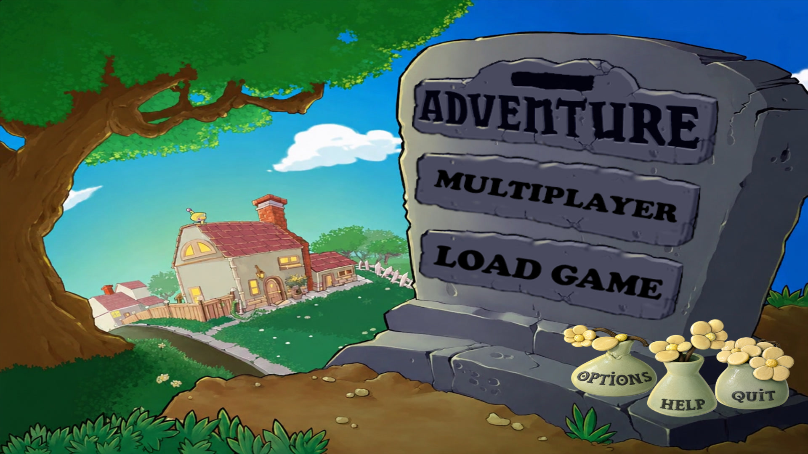
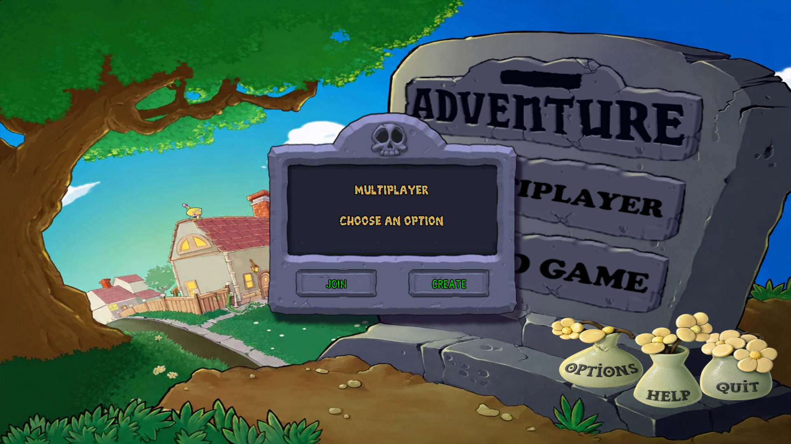
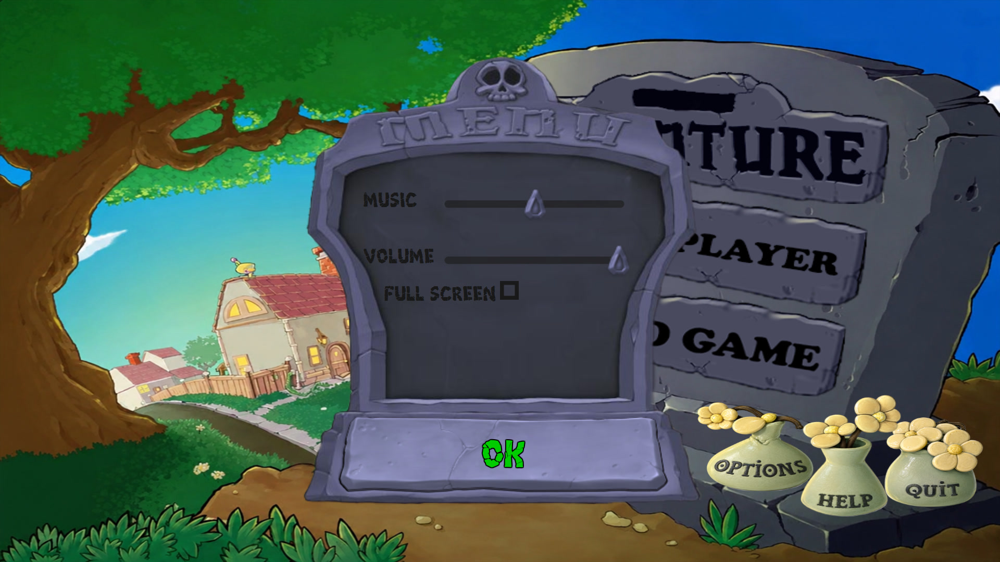

# 🌻 Plants vs. Zombies

### A faithful JavaFX recreation of the classic Plants vs. Zombies game

 <video src="screenshots/gameplay.mp4" controls width="900"></video> 

## 📖 About

This project is a fan-made recreation of the original **Plants vs. Zombies** game, developed in **Java** using **JavaFX**.

The goal of this project was not only to recreate the gameplay but also to practice object-oriented design, animation systems, game logic, UI development, and software architecture.

The game includes animated plants and zombies, a plant selection system, a multiplayer lobby, settings menu, sound effects, and many of the original gameplay mechanics.

## ✨ Features

- ✅ Original gameplay mechanics
- ✅ Multiple playable plants
- ✅ Various zombie types
- ✅ Plant selection system
- ✅ Multiplayer lobby
- ✅ Settings menu
- ✅ Fullscreen support
- ✅ Animated sprites
- ✅ Sound effects & music
- ✅ Projectile and collision system

## 🎯 Implemented Mechanics

- Plant placement system
- Card cooldown system
- Zombie AI
- Collision detection
- Projectile system
- Sun economy
- Health and damage system
- Lawn mower mechanics
- Animation manager
- Scene manager
- Multiplayer lobby

## 📷 Screenshots

### Main Menu

---

### Plant Selection

---

### Gameplay

---

### Multiplayer

---

### Settings

  

## 📦 Download

You can download the latest version from the **Releases** section.

👉 **[Download Latest Release](../../releases/latest)**

No installation or additional setup is required.

## 🛠 Tech Stack

- Java
- JavaFX
- Maven
- CSS
- Socket Programming
- Object-Oriented Programming (OOP)

## 🚧 Future Improvements

- More plants
- More zombie types
- Additional game modes
- Save & Load support
- Online multiplayer
- Performance optimizations

## ⚠ Disclaimer

This project is a fan-made recreation created for educational purposes.

Plants vs. Zombies and all related trademarks, characters, and original assets belong to PopCap Games and Electronic Arts.

No copyright infringement is intended.
